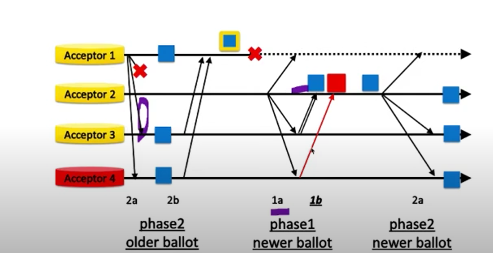

#distributed_systems #consensus 
**Authors:** Miguel Castro and Barbara Liskov

Algorithm for state machine replication that tolerates Byzantine Faults

**Why needed**?
- malicious actors in the cluster
- actors can send wrong values
- can forge messages (solvable with public-key cryptography)

**Assumptions**:
- each node should run different OS, have diff password and admin to make it difficult for the attacker.
- leaders must be non-malicious to ensure liveness
- we assume adversary cannot  delay correct nodes indefinitely
- we assume that the adversary is computationally bound , so that it can't subvert the cryptographic hash function (ex: can't produce hash signature of a non-faulty node)

**Algorithm**:
- the replicas move through a succession of configs called *views*
- one replica is primary others are backup in a view
- views are numbered consecutively 

> In 3f+1 servers PBFT can handle f failures/malicious nodes

> B-NFS only 3% slower than NFS

**Byzantine Paxos**
In the naive case we can increase the quorum size to q' = q + f where f are malicious
and q = 2f+1, we can think that this will work as f+1 real acceptors can outvote the liars. But in actuality this fails, because in of leader failure in phase 2b of paxos the algorithm can get stuck with f acceptors proposing one value and f fake acceptors voting another value.

possible solution: increase quorum size (byz-quorum) to outvote liars -> 3f+1
atleast 2f+1 intersection with f+1 real acceptors and f fakers, f+1 wins

**can we disable the lies in phase 1b?**
- require value in 1b to be attached with a proof
- assert this value was safe not fake
- proof is implied by 2a message (assume no 2a lies)

**Types of Malicious messages**

We will try to attach proof to either of this malicious messages to counter byzantine failures:

1. Phase 1a -> can lie by sending a very large value, but can't break safety
2. Phase 1b -> attach proof of previous P2a accept, we assume sender is not malicious (if in the previous phase 2a the current value was ever sent out, then it was proposed by the leading acceptor in the previous ballot)

Here we can see that acceptor 3 sends a message with a proof that it received authentic value from 2a, whereas acceptor 4 can't do that so it is rejected.

3. Phase 2a -> if leader is malicious in P2a, attach proof of previous P1b reply or add another phase 1c to send these proofs
4. Phase 2b -> can only respond in `yes/no` so doesn't really matter if rejected

**Questions:**
- can acceptors still lie in phase 1b?
- if so does it matter?
- what about lies in phase 2b?