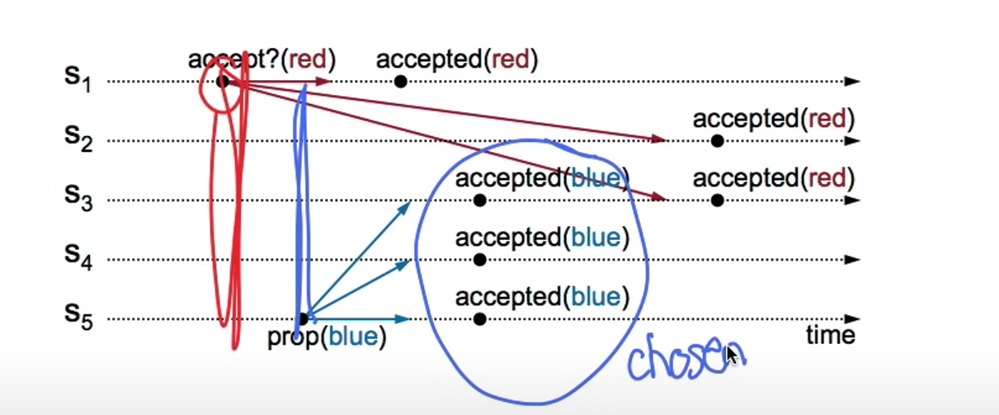

distributed consensus algorithm

### Basic Paxos

Reach consensus single value between multiple process.

Single acceptor? -> failure of acceptor -> no progress
multiple acceptors -> majority must accept to choose

> Value is chosen once accepted by a majority of acceptors

**Case 1:** only first value is accepted
Problem: for simultaneous proposal, every acceptor may have accepted some value but no majority. no value might be chosen

**Case 2:** multiple values can be accepted
Problem: values can be overwritten even if accepted by majority by a rogue proposer

> we need to strengthen our protocol. 2 phases are required for a proposer to learn that a value has not already been accepted by a majority. We will call the learning part a *Prepare* phase

**Case 3:** prepare a proposer first to see if value is already accepted
Problem: 

we can see still the blue might be overwritten by red if the accept request comes later for server 3. this happens only because as s1 accept was older it didn't get to learn about blue accept before sending the RPCs. we must reject older proposals. how to know older?

**A solution:**

1. order proposals with unique number. how unique - append server numbers (which are unique for each server)
2. higher number gets priority over lower numbers
3. remember highest seen proposal number
4. remember value of the highest accepted proposal number.

**Problems with Basic Paxos**
- Liveness is not guaranteed (solution is to randomize restarts)

### Multi-Paxos

